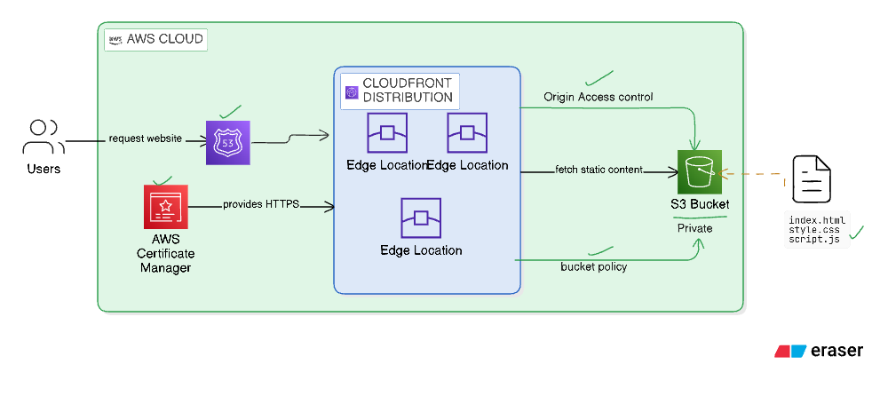

# 🌐 AWS Static Website with CloudFront & S3

[](https://terraform.io)
[](https://aws.amazon.com)
[](LICENSE)

A complete Terraform project that deploys a secure, scalable static website using AWS S3, CloudFront, Route 53, and ACM certificate management.

## 🏗️ Architecture Overview



This project creates a modern static website infrastructure with:

- **🪣 S3 Bucket**: Private bucket for storing static website files
- **🌍 CloudFront CDN**: Global content delivery with HTTPS
- **🔒 SSL/TLS**: Automatic certificate management via ACM
- **🌐 Route 53**: DNS management and domain routing
- **🛡️ Security**: Origin Access Control (OAC) for secure S3 access

## 📁 Project Structure

```
Day-14/
├── 📂 modules/                    # Reusable Terraform modules
│   ├── 📂 s3/                    # S3 bucket and policy management
│   │   ├── main.tf               # S3 resources
│   │   ├── variables.tf          # Input variables
│   │   └── outputs.tf            # Output values
│   ├── 📂 cloudfront/            # CloudFront distribution
│   │   ├── main.tf               # CloudFront resources
│   │   ├── variables.tf          # Input variables
│   │   └── outputs.tf            # Output values
│   └── 📂 route53/               # DNS and certificate management
│       ├── main.tf               # Route 53 and ACM resources
│       ├── variables.tf          # Input variables
│       └── outputs.tf            # Output values
├── 📂 environments/               # Environment-specific configurations
│   ├── 📂 dev/                   # Development environment
│   └── 📂 prod/                  # Production environment
├── 📂 www/                       # Static website files
│   ├── index.html                # Main HTML file
│   ├── style.css                 # Stylesheet
│   └── script.js                 # JavaScript files
├── 📄 main.tf                    # Main Terraform configuration
├── 📄 variables.tf               # Input variables
├── 📄 outputs.tf                 # Output values
├── 📄 terraform.tfvars           # Variable values (not in git)
├── 📄 .gitignore                 # Git ignore rules
└── 📄 README.md                  # This file
```

## 🚀 Quick Start

### Prerequisites

- [Terraform](https://terraform.io/downloads.html) >= 1.0
- [AWS CLI](https://aws.amazon.com/cli/) configured with appropriate credentials
- An AWS account with necessary permissions

### 1. Clone and Setup

```bash
# Clone the repository
git clone https://github.com/VanshShah174/s3-cloudfront-Terraform.git
cd s3-cloudfront-Terraform

# Copy example variables
cp terraform.tfvars.example terraform.tfvars
```

### 2. Configure Variables

Edit `terraform.tfvars` with your values:

```hcl
bucket_name  = "your-unique-bucket-name-2024"
domain_name  = "your-domain.com"
environment  = "dev"
```

### 3. Deploy Infrastructure

```bash
# Initialize Terraform
terraform init

# Review the plan
terraform plan

# Apply the configuration
terraform apply
```

### 4. Access Your Website

After deployment, your website will be available at the CloudFront URL shown in the outputs.

## 📋 Configuration

### Variables

| Variable | Description | Type | Default |
|----------|-------------|------|---------|
| `bucket_name` | S3 bucket name (must be globally unique) | `string` | `"s3-bucket-terraform-with-cloudfront-v1-2901"` |
| `domain_name` | Domain name for the website | `string` | `"piyush-terraform-demo.com"` |
| `environment` | Environment name (dev/staging/prod) | `string` | `"dev"` |

### Outputs

| Output | Description |
|--------|-------------|
| `website_url` | CloudFront distribution URL |
| `s3_bucket_name` | S3 bucket name |
| `cloudfront_distribution_id` | CloudFront distribution ID |
| `route53_zone_id` | Route 53 hosted zone ID |
| `route53_name_servers` | Name servers for domain configuration |
| `acm_certificate_arn` | ACM certificate ARN |

## 🔧 Customization

### Adding Custom Domain

1. **Own a domain**: Register a domain or use an existing one
2. **Update variables**: Set your domain in `terraform.tfvars`
3. **Enable validation**: Set `enable_certificate_validation = true` in Route 53 module
4. **Update nameservers**: Point your domain to Route 53 nameservers

### Environment-Specific Deployments

```bash
# Development
terraform workspace new dev
terraform apply -var-file="environments/dev/terraform.tfvars"

# Production
terraform workspace new prod
terraform apply -var-file="environments/prod/terraform.tfvars"
```

## 🛡️ Security Features

- ✅ **Private S3 Bucket**: No public access, secured with bucket policies
- ✅ **Origin Access Control**: CloudFront-only access to S3
- ✅ **HTTPS Enforcement**: Automatic redirect to HTTPS
- ✅ **SSL/TLS Certificates**: Free certificates via AWS Certificate Manager
- ✅ **IAM Policies**: Least privilege access principles

## 💰 Cost Optimization

- **S3**: Pay only for storage used
- **CloudFront**: Free tier includes 1TB data transfer
- **Route 53**: $0.50/month per hosted zone
- **ACM**: SSL certificates are free
- **Estimated monthly cost**: $1-5 for small websites

## 🔍 Monitoring & Maintenance

### CloudWatch Metrics
- CloudFront request count and error rates
- S3 bucket size and request metrics
- Certificate expiration monitoring

### Maintenance Tasks
- Monitor CloudFront cache hit ratios
- Review S3 access logs
- Update website content in `www/` folder

## 🚨 Troubleshooting

### Common Issues

**Certificate Validation Fails**
```bash
# Check domain validation records
aws route53 list-resource-record-sets --hosted-zone-id <zone-id>
```

**CloudFront Not Serving Updated Content**
```bash
# Invalidate CloudFront cache
aws cloudfront create-invalidation --distribution-id <dist-id> --paths "/*"
```

**S3 Access Denied**
- Verify bucket policy allows CloudFront access
- Check Origin Access Control configuration

## 🤝 Contributing

1. Fork the repository
2. Create a feature branch (`git checkout -b feature/amazing-feature`)
3. Commit your changes (`git commit -m 'Add amazing feature'`)
4. Push to the branch (`git push origin feature/amazing-feature`)
5. Open a Pull Request

## 📝 License

This project is licensed under the MIT License - see the [LICENSE](LICENSE) file for details.

## 🙏 Acknowledgments

- [Terraform AWS Provider](https://registry.terraform.io/providers/hashicorp/aws/latest)
- [AWS Documentation](https://docs.aws.amazon.com/)
- [Terraform Best Practices](https://www.terraform-best-practices.com/)

## 📞 Support

If you have questions or need help:

- 📧 Email: vanshshah174@gmail.com
- 🐛 Issues: [GitHub Issues](https://github.com/VanshShah174/s3-cloudfront-Terraform/issues)
- 💬 Discussions: [GitHub Discussions](https://github.com/VanshShah174/s3-cloudfront-Terraform/discussions)

---

⭐ **Star this repository if it helped you!** ⭐